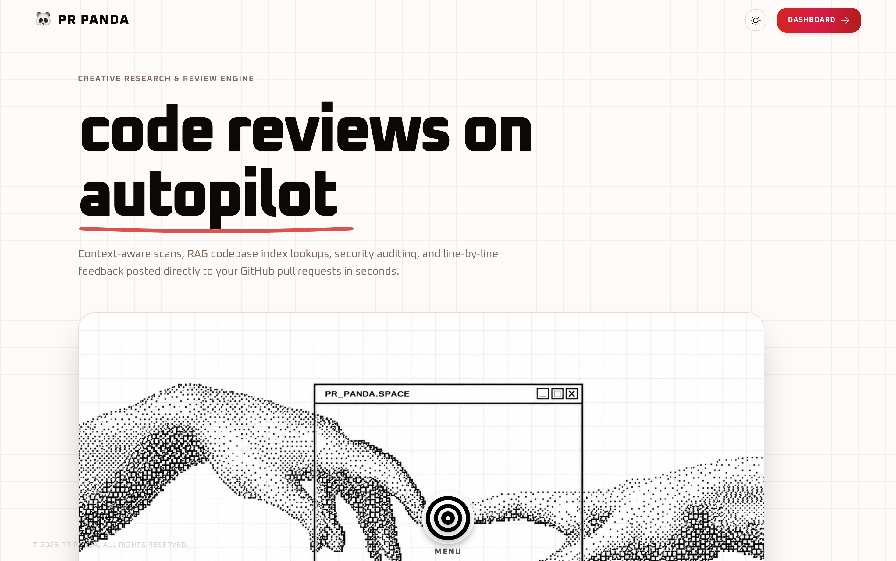
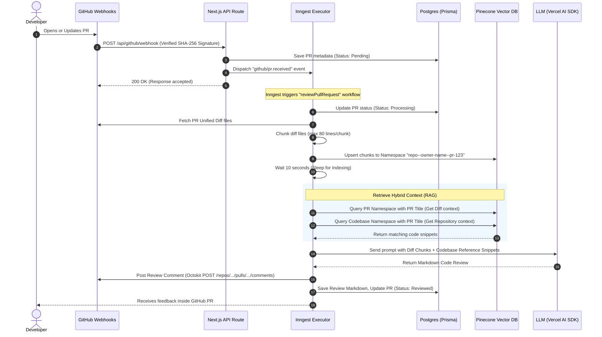
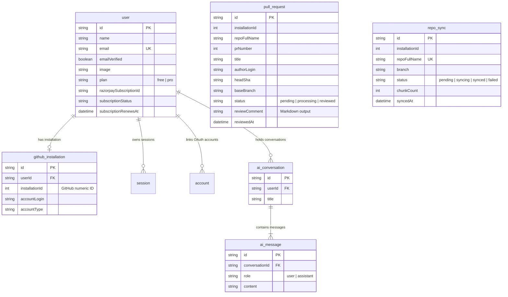

# 🐼 PR Panda — AI-Powered Code Review Agent & Assistant

[](https://prpanda.priyanshu.cv)
[-black?style=for-the-badge&logo=nextdotjs)](https://nextjs.org/)
[](https://neon.tech/)
[](https://www.inngest.com/)
[](https://www.pinecone.io/)

PR Panda is a state-of-the-art, automated **AI Code Review Agent** designed to integrate directly into developer workflows. It connects seamlessly to GitHub, monitors repository activity, and automatically conducts deep-dive code reviews on Pull Requests (PRs).

By leveraging **Hybrid Retrieval-Augmented Generation (RAG)**, PR Panda goes beyond basic line-by-line linting. It performs semantic searches across the entire codebase to understand broader context, style guides, and structural dependencies, outputting constructive, context-aware reviews straight to GitHub comments.

---

## 📸 Product Interface



*Live Application:* [https://prpanda.priyanshu.cv](https://prpanda.priyanshu.cv)

---

## 📌 Problem & Solution

### The Problem
* **Review Bottlenecks:** Pull requests often sit open for hours or days waiting for human reviews, stalling development velocity and blocking releases.
* **Cognitive Load & Context Switching:** Developers lose focus when switching between coding their own features and reviewing complex, unfamiliar pull requests.
* **Inconsistent Quality Control:** Human reviewers can miss subtle security bugs, performance hot paths, syntax exceptions, or architectural deviations under pressure.
* **Lack of Context:** Traditional automated tools (linters/static analyzers) only look at the modified lines, lacking the codebase-wide awareness needed to spot integration issues.

### The Solution
* **Instant First-Pass Reviews:** PR Panda initiates a comprehensive review within seconds of a PR being opened or updated, reducing cycle times.
* **Semantic Codebase Context (RAG):** It syncs the entire repository to a vector database. When a PR is reviewed, the AI retrieves relevant reference snippets from the broader codebase to ensure compatibility.
* **Actionable Developer Feedback:** Instead of simple flags, PR Panda provides categorized feedback (Critical, Warnings, Suggestions) with clear explanation and code suggestions.
* **Interactive AI Dashboard Chat:** Developers can converse with a context-rich dashboard assistant about their repository sync status, database schema, usage limits, and codebase details.

---

## 🛠 Tech Stack Overview & Rationale

PR Panda uses a modern, high-performance tech stack designed for asynchronous event processing, vector search, and interactive user interfaces.

| Technology | Category | Purpose in PR Panda | Engineering Rationale |
| :--- | :--- | :--- | :--- |
| **Next.js 16 (React 19)** | Frontend & Routing | Main application framework, Server-Side Rendering (SSR), App Router API routing. | Delivers a premium, fast UI utilizing React Server Components (RSCs) and route optimization. |
| **TypeScript** | Language | Type safety across the full stack. | Ensures maintainability, self-documenting code, and reduces runtime bugs in complex AI logic. |
| **PostgreSQL & Prisma** | Database / ORM | Relational data persistence (Users, GitHub Apps, PR history, AI chats, billing logs). | Postgres handles transactional integrity. Prisma provides clean schema migrations and type-safe database queries. |
| **Inngest** | Background Jobs | Event-driven workflow orchestrator for codebase sync and PR reviews. | Replaces complex Redis/BullMQ setups with a serverless, stateful event queue that handles retries, delays, and flow control. |
| **Pinecone DB** | Vector Database | Codebase vector search index (semantic code search). | Serverless indexes allow instant setups. Built-in `upsertRecords` and `searchRecords` handle embeddings internally, avoiding manual OpenAI API embedding calls. |
| **Vercel AI SDK** | AI Framework | LLM prompt management, structured outputs, and response streaming. | Standardizes interactions with AI models, allowing seamless transitions between providers and streaming dashboard chats. |
| **OpenRouter / Groq** | LLM API Providers | Access to high-throughput LLMs (e.g., Llama 3.3, Claude, deepseek). | Groq provides ultra-fast response streams for conversational chat (`llama-3.3-70b-versatile`), while OpenRouter offers cost-efficient review models. |
| **Better Auth** | Authentication | User authentication and session management. | Integrates natively with Next.js, handling secure session states and OAuth integration with GitHub out of the box. |
| **Octokit (GitHub SDK)** | GitHub Integration | Interacting with repository trees, PR diffs, and comments. | The industry-standard client for GitHub Apps, allowing secure API calls using installation JWTs. |
| **Razorpay** | Payments | Subscriptions and payment workflows. | Seamless checkout and billing dashboard logic for monetizing premium user tiers. |
| **Tailwind CSS v4** | Styling | Styling the dashboard and landing page. | Provides a modern utility-first CSS framework with native CSS variables for rapid, gorgeous UI styling. |
| **Framer Motion** | Animation | UI micro-interactions and route transitions. | Adds fluid transitions, interactive rings, and premium dashboard micro-animations. |
| **Recharts** | Analytics | Dashboard charts and metrics. | Renders responsive SVG charts (PR review speeds, success rates) with interactive tooltips. |

---

## 🔄 System Architecture & Flow

PR Panda relies on an event-driven flow that spans GitHub webhooks, Inngest serverless queues, Pinecone namespace indexing, and LLM text generation.



---

## 💾 Database Schema

PR Panda's database schema maps user profiles, GitHub app installations, codebase tracking, and interactive AI chat history.



---

## 💡 RAG Pipeline: How the AI Reviews Code

### 1. Smart Code Chunking
When code is retrieved, PR Panda partitions files dynamically:
* Chunks are split on line boundaries, with a maximum of **80 lines per chunk** to preserve logical context.
* It skips large binary assets and irrelevant directories (e.g., `node_modules/`, `dist/`, `.next/`).
* File extensions are strictly filtered to target actual source files (`.ts`, `.tsx`, `.py`, `.go`, `.java`, etc.).

### 2. Isolated Pinecone Namespaces
To prevent cross-pollution and security risks:
* **The Codebase Index:** Synced repositories write vector records directly into a dedicated codebase namespace (`${owner}--${repo}--codebase`). This remains static until manually synced or triggered by codebase updates.
* **The Pull Request Index:** Each individual pull request is isolated into its own runtime namespace (`${owner}--${repo}--pr-${prNumber}`). This contains only the specific diff lines introduced in the PR.

### 3. Contextual Retrieval (Hybrid RAG)
When reviewing a PR:
1. The PR title is used to perform a semantic query against the PR's namespace, identifying the core changes.
2. The PR title is also used to query the broader codebase namespace, retrieving existing helper functions, API definitions, or UI components.
3. Both sets of context are injected into the system prompt: the LLM reviews the **diff chunks** while using the **codebase snippets** as reference guides, ensuring compliance with existing architecture and naming conventions.

---

## 🚀 Getting Started

Follow these steps to run PR Panda locally on your development machine.

### Prerequisites
* **Node.js** (v18.x or later)
* **PostgreSQL** database (Local instance or host like Neon)
* **GitHub App** registration (Requires setup of Client ID, Secret, App ID, and Webhook Secret)
* **Pinecone DB** Account (For indexing and vector similarity search)

### Step 1: Clone and Install
```bash
git clone https://github.com/priyanshwho/pr-panda.git
cd pr-panda
npm install
```

### Step 2: Environment Variables
Create a `.env` file in the root directory. You can copy the template from `.env.example`:
```bash
cp .env.example .env
```
Fill out the variables inside `.env` with your credentials (e.g., Database URL, Better Auth secret, GitHub App keys, Pinecone API key, LLM Provider keys).

### Step 3: Run Migrations and Generate Prisma Client
```bash
npx prisma db push
npx prisma generate
```

### Step 4: Run the Development Server
```bash
# Run Next.js app in development mode
npm run dev

# Run Inngest development server in a separate terminal window
npx inngest-cli@latest dev
```

Your app will be available at `http://localhost:3000` and the Inngest local dashboard at `http://localhost:8288`.

---

## 💼 Portfolio & Resume Highlights

* **Architected and built PR Panda**, a full-stack, serverless AI Code Review Agent using **Next.js 16**, **TypeScript**, and **Tailwind CSS v4** to automate Pull Request reviews on GitHub.
* **Implemented an event-driven background pipeline** using **Inngest**, processing GitHub webhook payloads asynchronously, handling chunking logic, and executing vector indexing without API timeout failures.
* **Designed a hybrid RAG pipeline** using **Pinecone Vector Database** serverless indices, isolating PR diff changes and overall codebase structures inside secure, separate namespaces for context-aware code analysis.
* **Integrated LLM APIs via Vercel AI SDK**, orchestrating prompts for **Groq (Llama-3.3)** and **OpenRouter** to output structural code analysis (Critical, Warning, Suggestions) straight to GitHub PR comments using **Octokit**.
* **Developed an interactive AI Chat assistant** in the dashboard, utilizing **semantic vector database retrieval** to answer developer questions about their connected repositories and active pull requests.
* **Persisted application state** by modeling a relational database schema using **Prisma ORM** and **PostgreSQL**, managing user sessions with **Better Auth**, and integrating **Razorpay** to process premium subscription tiers.
* **Created a premium UX dashboard** featuring micro-animations (**Framer Motion**), interactive layouts, and dynamic visualizations (**Recharts**) to display review counts, repository sync progress, and key developer metrics.
